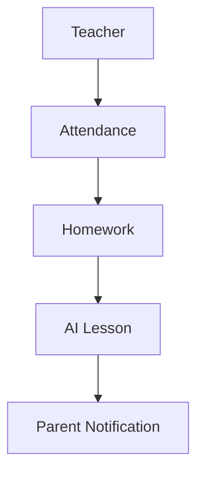

# High-Level Architecture

## System Concept
DAVI uses a modular architecture that separates the web application, mobile application, API layer, data layer, and AI orchestration services.

## Core Technology Decisions
- Next.js for the web frontend
- React Native for mobile experiences
- NestJS for backend APIs
- PostgreSQL for relational data storage
- Prisma as the ORM and schema layer
- Redis for caching and queue support
- Docker for containerized development and deployment

## Architecture Diagram

Client Layer
- Next.js Web App
- React Native Mobile App

Application Layer
- NestJS API
- Authentication / Authorization
- Business Services
- DAVI Super Admin platform controls

Data & Integration Layer
- PostgreSQL
- Prisma
- Redis
- AI service interfaces

## Product Flow

## High-Level Flow
Teacher → Web/Mobile App → NestJS API → PostgreSQL/Redis → AI assistant services → Notifications

## Development Environment
- Local development uses Docker containers for the app stack
- PostgreSQL and Redis run as services for development consistency
- Node.js and package managers are standardized for frontend and backend workspaces
- Environment variables are separated by stage for dev/test/prod

## Architectural Principles
- Modular service boundaries
- API-first design
- Role-based access control
- Platform-level DAVI Super Admin separation from school-scoped roles
- Event-driven communication where practical
- Reliability for daily school operations

## Deployment Strategy
- Dockerized services for local development
- Container orchestration-ready for staging and production
- Environment-based configuration for dev, test, and production
